# AARVIS Mermaid Diagram Set

This file combines all Mermaid diagrams for the `final fixed fyp` smart mirror project.

## 1. Gantt Chart

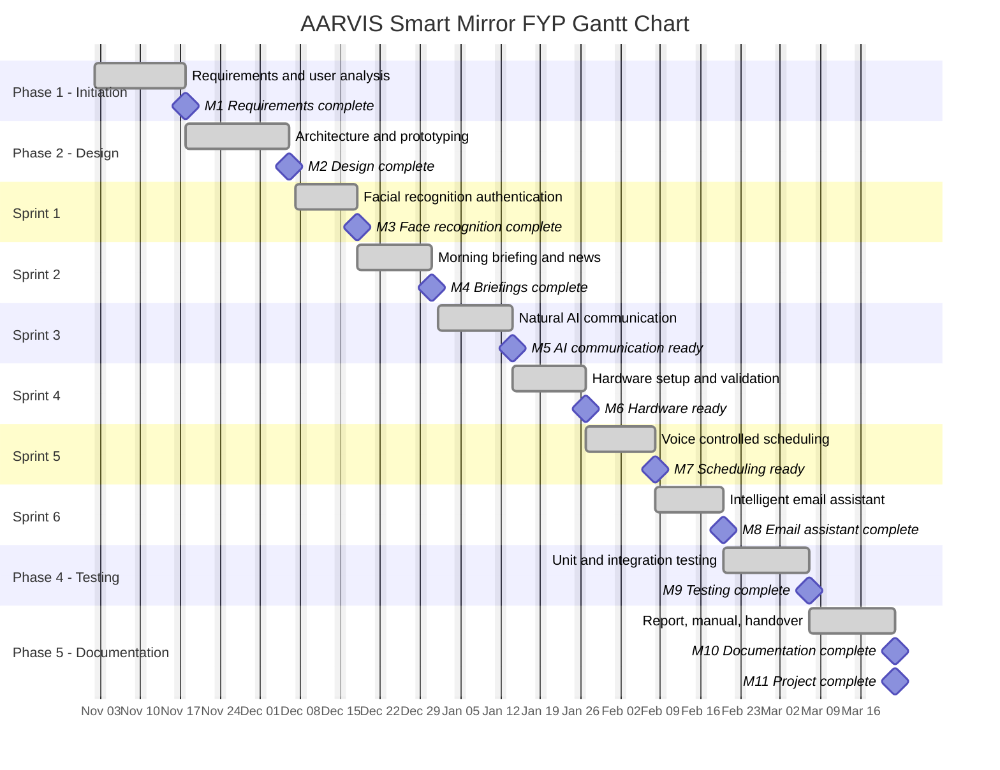

## 2. Milestone Timeline

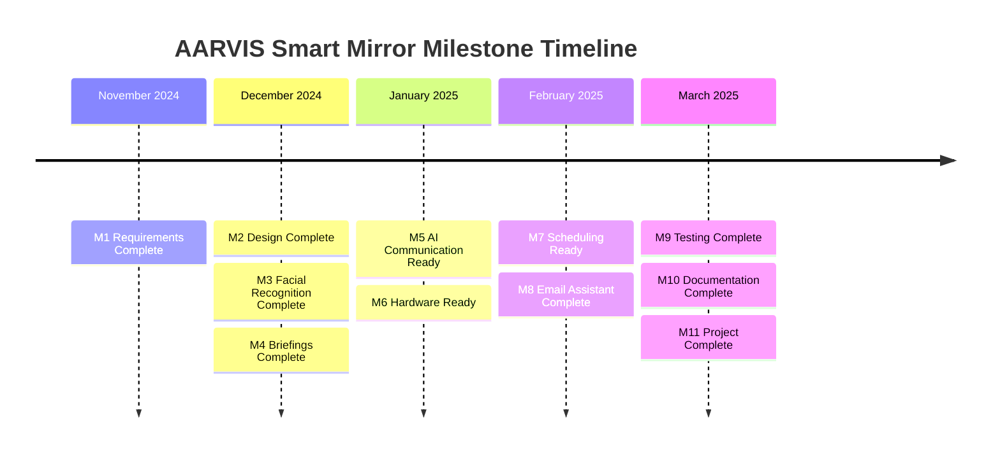

## 3. WBS

```mermaid
flowchart TD
    A["1.0 AARVIS Smart Mirror FYP"]
    A --> B["1.1 Project Initiation and Requirements"]
    B --> B1["1.1.1 Requirement identification"]
    B --> B2["1.1.2 User needs analysis"]
    B --> B3["1.1.3 Product backlog and sprint planning"]
    A --> C["1.2 Design and Prototyping"]
    C --> C1["1.2.1 Core architecture design"]
    C --> C2["1.2.2 Prototype subsystems"]
    C --> C3["1.2.3 Technical diagrams"]
    C --> C4["1.2.4 Feedback based design refinement"]
    A --> D["1.3 Sprint Based Development"]
    D --> D1["1.3.1 Sprint 1 - Face authentication"]
    D1 --> D11["Detection, embedding, face login"]
    D --> D2["1.3.2 Sprint 2 - Briefing and live widgets"]
    D2 --> D21["Weather, news, calendar, morning briefing"]
    D --> D3["1.3.3 Sprint 3 - Natural AI communication"]
    D3 --> D31["LangGraph, STT, TTS, WebSocket streaming"]
    D --> D4["1.3.4 Sprint 4 - Hardware setup"]
    D4 --> D41["Raspberry Pi, monitor, camera, network"]
    D --> D5["1.3.5 Sprint 5 - Voice scheduling"]
    D5 --> D51["Read, create, update, delete calendar events"]
    D --> D6["1.3.6 Sprint 6 - Email assistant"]
    D6 --> D61["Read, summarize, draft, send emails"]
    A --> E["1.4 Testing and Quality Assurance"]
    E --> E1["1.4.1 Unit testing"]
    E --> E2["1.4.2 Integration testing"]
    E --> E3["1.4.3 User feedback testing"]
    E --> E4["1.4.4 Bug fixing and refinement"]
    A --> F["1.5 Documentation and Handover"]
    F --> F1["1.5.1 Project report"]
    F --> F2["1.5.2 User manual"]
    F --> F3["1.5.3 FAQ and feature guide"]
    F --> F4["1.5.4 Final submission"]
```

## 4. Mind Map

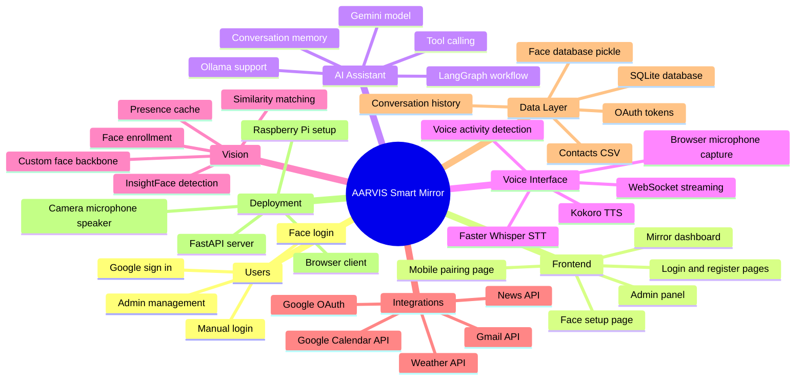

## 5. System Architecture

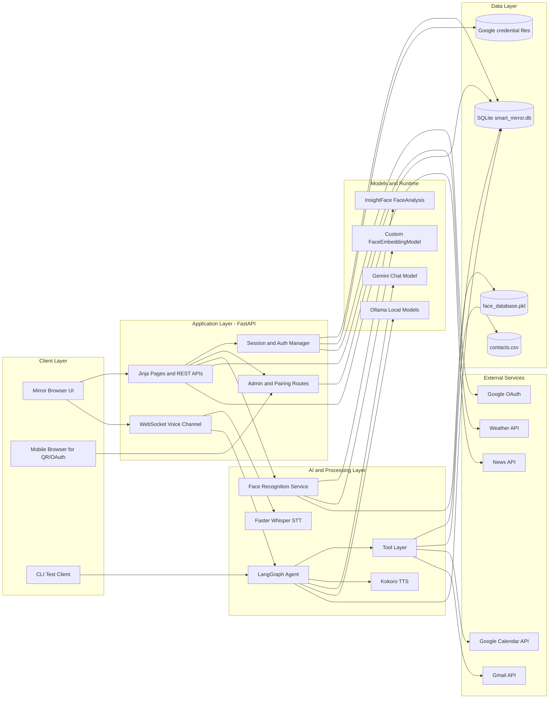

## 6. Use Case Diagram

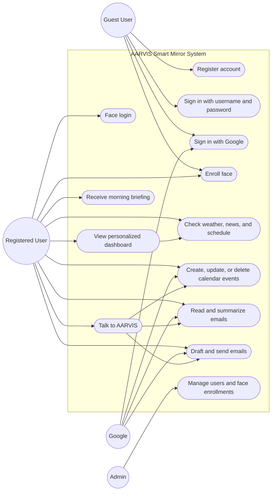

## 7. Sequence Diagram

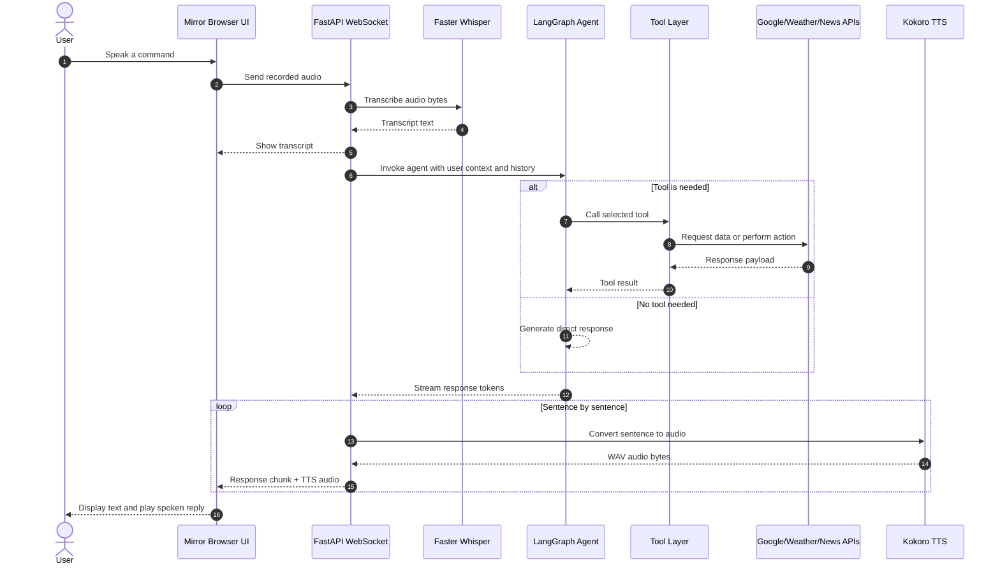

## 8. Flow Chart

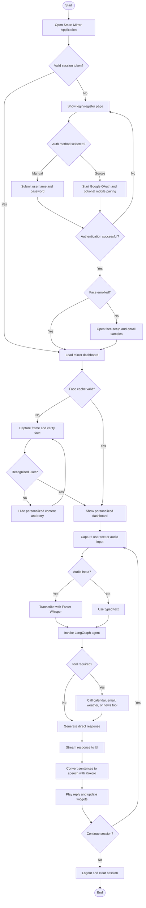

## 9. Entity Relationship Diagram

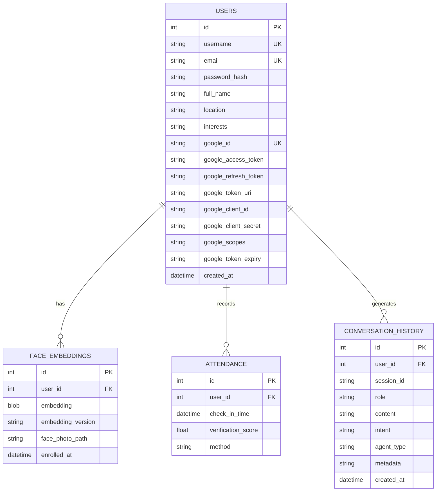

## 10. Data Flow Diagram

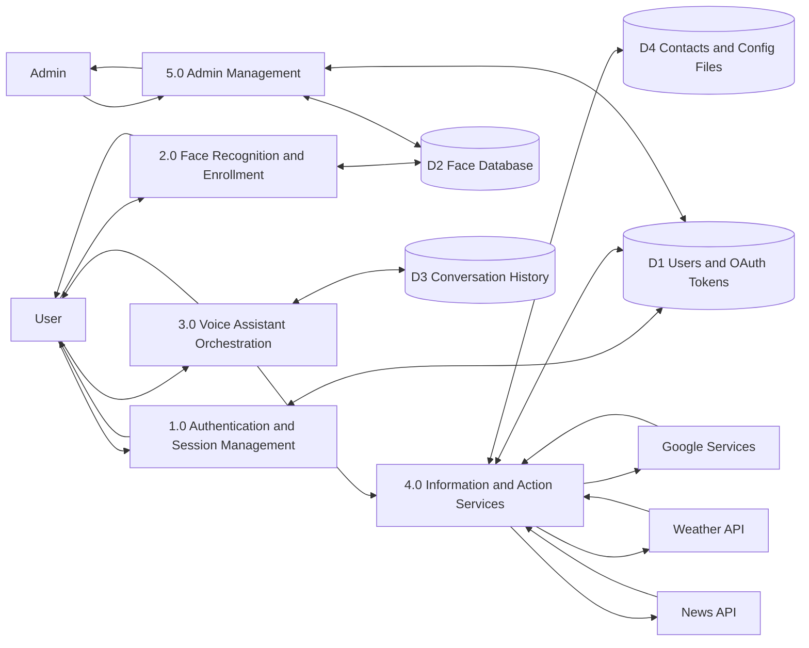

## 11. Wireframe

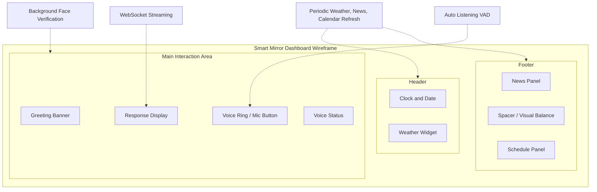
